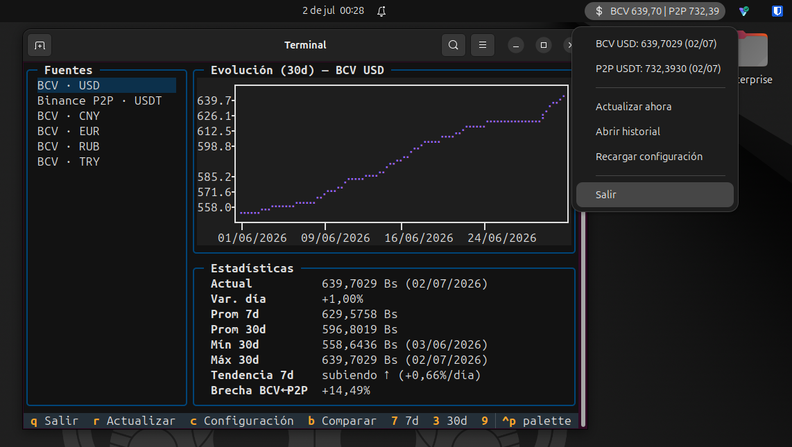
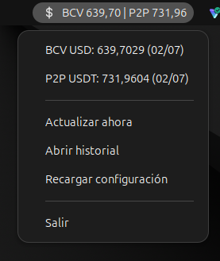
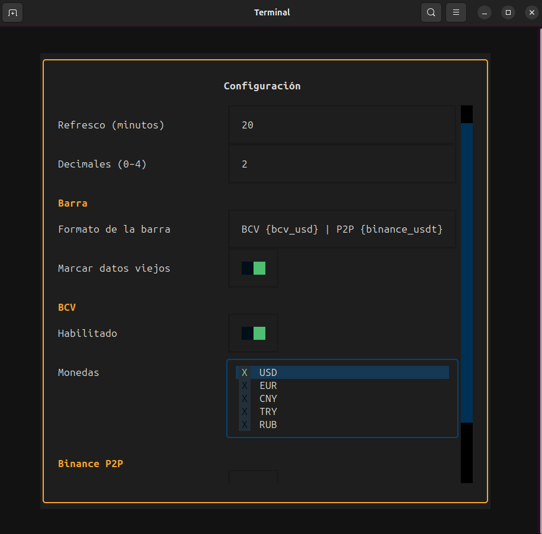

# lazyrate

> Tasa oficial del BCV y Binance P2P (USDT/VES) en la barra superior de GNOME y en una TUI
> estilo [lazydocker](https://github.com/jesseduffield/lazydocker).

[](https://github.com/zerodaty/lazyrate/releases)
[](https://github.com/zerodaty/lazyrate/actions)
[](LICENSE)
[](https://www.python.org/)

## Origen

¡Epale! ¿Qué tal? Como bien saben, mi amado país Venezuela tiene una peculiaridad
muy nuestra: ¡las benditas tasas! Y como me la paso todo el día en la PC —ya sea
trabajando o haciendo este tipo de cosas— me fastidiaba mucho tener que ir a
Binance o a la web del BCV para chequear la tasa actual y cuánto había variado.
Así que, estando en mi casa, junté mi necesidad, mi aprecio por las lazyapps como
[lazydocker](https://github.com/jesseduffield/lazydocker) y el estreno de
**Fable 5**, el nuevo modelo de Anthropic —a todo esto me dije: ¿qué tal si
quemamos tokens un rato?— y así nació **lazyrate**. 🇻🇪

## ¿Qué muestra?

- **Tasa oficial del BCV** — USD, EUR, CNY, TRY y RUB, leídas directamente del Excel
  oficial "otras monedas" que publica el Banco Central de Venezuela. Cuando el BCV
  publica la tasa del día siguiente por la tarde, lazyrate también la captura y la
  muestra como "próxima".
- **USDT/VES de Binance P2P** — promedio ponderado por cantidad sobre ~100 anuncios,
  con filtro de outliers por rango intercuartílico (IQR) para descartar precios anzuelo.

Y lo muestra en dos lugares:

1. **La barra superior de GNOME**, vía AppIndicator: un texto configurable tipo
   `BCV 108,52 | P2P 130,04` que se refresca solo, con menú para abrir la TUI o
   forzar una actualización.
2. **Una TUI estilo lazydocker** con gráfica histórica y panel de estadísticas:
   variación del día, promedios de 7 y 30 días, mínimo/máximo, tendencia
   (subiendo ↑ / bajando ↓ / estable →) y brecha BCV↔P2P. La lista de fuentes
   funciona como mini-dashboard: cada par muestra su tasa vigente y la variación
   del día en color; y cuando el BCV ya publicó la tasa de mañana, las estadísticas
   la muestran como "Próxima". Junto a "Fuentes" hay una pestaña **Calculadora**
   (o tecla `=`): convierte un monto entre dos tasas a elegir —divisa→Bs o
   Bs→divisa— y muestra el % de disparidad, mientras el panel derecho grafica esas
   dos tasas superpuestas en el tiempo con sus estadísticas de brecha.

Además, `lazyrate backfill` importa el **histórico oficial del BCV del año completo**
(desde el primer día hábil del año) a partir de los Excel trimestrales que publica el
propio banco, para que la gráfica tenga contexto desde la primera ejecución.

## Capturas


La TUI junto al indicador de la barra de GNOME:



El indicador y su menú de cerca:



La pantalla de configuración (`c` dentro de la TUI):



## Instalación

### Ubuntu / Debian (recomendado)

Descarga el `.deb` desde [Releases](https://github.com/zerodaty/lazyrate/releases) e instala:

```bash
sudo apt install ./lazyrate_*.deb
```

El paquete instala el indicador de la barra, lo deja autoarrancado en cada sesión y
trae las dependencias del sistema (PyGObject/AppIndicator) ya resueltas.

### Fedora (y otras distros)

El indicador usa PyGObject/AppIndicator **del sistema** (no son pip-instalables),
así que primero instala esas librerías con tu gestor de paquetes:

```bash
# Fedora
sudo dnf install python3-gobject libayatana-appindicator-gtk3
# Debian/Ubuntu (si no usas el .deb)
sudo apt install python3-gi gir1.2-ayatanaappindicator3-0.1
```

y luego instala lazyrate con pipx — el `--system-site-packages` es imprescindible
para que el indicador vea PyGObject, y el extra `[tui]` trae la interfaz de terminal:

```bash
pipx install --system-site-packages 'lazyrate[tui] @ git+https://github.com/zerodaty/lazyrate'
```

En GNOME ≥ 41 necesitas además la extensión
[AppIndicator and KStatusNotifierItem Support](https://extensions.gnome.org/extension/615/appindicator-support/)
para que el indicador aparezca en la barra. La TUI y la CLI no dependen de nada de
esto: funcionan en cualquier distro y escritorio; solo el indicador requiere una
barra con soporte AppIndicator.

### Desde el código

```bash
git clone https://github.com/zerodaty/lazyrate
cd lazyrate
pipx install --system-site-packages '.[tui]'
```

## Uso

```bash
lazyrate                      # abre la TUI
lazyrate now                  # tasas vigentes al instante, desde la base local (sin red)
lazyrate now --json           # lo mismo en JSON, para scripts y barras de estado
lazyrate fetch                # consulta y guarda las tasas ahora (BCV + Binance)
lazyrate fetch --source bcv   # solo una fuente (bcv | binance)
lazyrate history --days 30    # histórico guardado, en la terminal
lazyrate backfill             # importa el histórico BCV del año (--year para otro año)
lazyrate autostart enable     # autoarranque del indicador (enable | disable | status)
lazyrate-indicator            # daemon del indicador de GNOME (en primer plano)
```

`lazyrate now` muestra por par la tasa vigente, la variación del día y —cuando el BCV
ya publicó la del día siguiente— la tasa "próxima", más la brecha BCV↔P2P. No toca la
red (lee lo último guardado), así que responde al instante y sirve para `watch`, scripts
o barras de estado tipo waybar/polybar vía `--json`.

Con el `.deb`, `lazyrate-indicator` se autoarranca al iniciar sesión; no hace falta
lanzarlo a mano. Con pipx, actívalo con `lazyrate autostart enable`.

## Configuración

El archivo es `~/.config/lazyrate/config.toml`; se crea con los valores por defecto la
primera vez que se ejecuta cualquier comando.

| Clave                     | Default                                 | Descripción                                                                                                                       |
| ------------------------- | --------------------------------------- | --------------------------------------------------------------------------------------------------------------------------------- |
| `general.refresh_minutes` | `20`                                    | Minutos entre actualizaciones automáticas (indicador y TUI).                                                                      |
| `general.decimals`        | `2`                                     | Decimales al mostrar tasas en la barra.                                                                                           |
| `general.retention_days`  | `365`                                   | Días de histórico que se conservan en la base de datos.                                                                           |
| `bar.format`              | `"BCV {bcv_usd} \| P2P {binance_usdt}"` | Plantilla del texto de la barra. Placeholders: `{bcv_usd}`, `{bcv_eur}`, `{bcv_cny}`, `{bcv_try}`, `{bcv_rub}`, `{binance_usdt}`. |
| `bar.stale_mark`          | `true`                                  | Añade una marca cuando los datos llevan demasiado tiempo sin refrescarse.                                                         |
| `bcv.enabled`             | `true`                                  | Consultar la tasa oficial del BCV.                                                                                                |
| `bcv.currencies`          | `["USD"]`                               | Monedas del BCV a seguir: `USD`, `EUR`, `CNY`, `TRY`, `RUB`.                                                                      |
| `bcv.publish_hour`        | `18`                                    | Hora (America/Caracas) desde la que se busca también la tasa del día siguiente.                                                   |
| `binance.enabled`         | `true`                                  | Consultar Binance P2P.                                                                                                            |
| `binance.asset`           | `"USDT"`                                | Activo a cotizar en Binance P2P.                                                                                                  |
| `binance.trade_type`      | `"SELL"`                                | Lado del libro: `SELL` (vender USDT por Bs) o `BUY`.                                                                              |
| `binance.merchant_only`   | `true`                                  | Considerar solo anuncios de comerciantes verificados.                                                                             |
| `binance.max_ads`         | `100`                                   | Máximo de anuncios a promediar.                                                                                                   |

Los datos se guardan en rutas XDG estándar: histórico en
`~/.local/share/lazyrate/history.db` (SQLite) y logs en `~/.local/state/lazyrate/`.

## Atajos de la TUI

| Tecla                 | Acción                                                                                          |
| --------------------- | ----------------------------------------------------------------------------------------------- |
| `q`                   | Salir                                                                                           |
| `r`                   | Refrescar (consulta las fuentes ahora; si la BD está vacía, además hace el backfill)            |
| `c`                   | Abrir la pantalla de configuración                                                              |
| `=`                   | Alternar entre las pestañas Calculadora y Fuentes (`Esc` también vuelve a Fuentes)              |
| `b`                   | Comparar fuentes (superpone BCV y Binance en la gráfica)                                        |
| `7` / `3` / `9` / `a` | Rango de la gráfica: 7, 30, 90 días o todo                                                      |
| `Tab`                 | Cambiar de panel                                                                                |
| `↑`/`↓` o `j`/`k`     | Moverse por la lista                                                                            |

## Nota sobre el certificado SSL del BCV

La web del BCV suele servir una cadena de certificados rota (falta el intermedio), por
lo que la verificación TLS estricta falla en muchos sistemas. lazyrate intenta
**siempre** primero con verificación completa y, solo si falla por ese motivo,
reintenta sin verificar — acotado exclusivamente al dominio `bcv.org.ve`. Nunca se
desactiva la verificación de forma global ni para Binance.

## Desarrollo

```bash
git clone https://github.com/zerodaty/lazyrate
cd lazyrate
python3 -m venv --system-site-packages .venv   # --system-site-packages por PyGObject/GTK
source .venv/bin/activate
pip install -e ".[dev]"
pytest
ruff check .
```

Para construir el paquete Debian:

```bash
ln -s packaging/debian debian
dpkg-buildpackage -us -uc -b
```

## Licencia

[MIT](LICENSE) — Frany Velasquez ([github.com/zerodaty](https://github.com/zerodaty)).

## About

lazyrate is a lightweight Python app for Venezuelan users (and anyone tracking the
bolívar): it shows the official BCV exchange rate and the Binance P2P USDT/VES rate in
the GNOME top bar via AppIndicator, plus a lazydocker-style TUI with historical charts
and statistics. Data comes straight from the official BCV Excel files and the public
Binance P2P search endpoint, stored locally in SQLite. MIT licensed.
